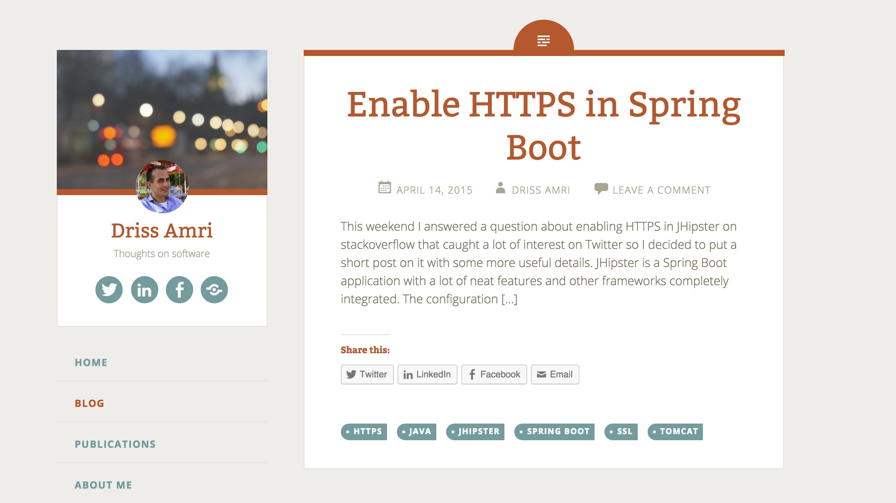

Welcome to the new and (hopefully) improved **drissamri.be v2.0**.
I launched v1.0 of my website around October 2014. Most people I knew that had a website were using WordPress, so to get started quickly I went with that. While WordPress is great, it's a bit of a heavy weight solution for a small site like this.

If you have been here before, you'll notice the site has gone through a complete overhaul.
It used to be a WordPress site with a tweaked [Fictive](https://wordpress.org/themes/fictive/) theme:

### Why switch?
If you have been following the news, there were quite some WordPress security problems lately.
It seemed like every day you had to update because a new problem came up.
I realized I spent more time this month on maintaince rather than actual creating content.
For a simple site this I didn't want to manage such a heavyweight solution anymore.

### Hello Jekyll!
Last week I decided to play around with a great lightweight static site generator: [Jekyll](http://jekyllrb.com/).  
For those that don't know Jekyll:

> Jekyll is a simple, blog-aware, static site generator. It takes a template directory containing raw text files in various formats, runs it through a converter (like Markdown) and Liquid renderer, and spits out a complete, ready-to-publish static website suitable for serving with your favorite web server.

You see more and more people trade in their WordPress with a static site generator like Jekyll.
This completely makes sense for performance of a site like this, since most of the content is static.
No more security updates every week, no more database, no more unnecessary maintenance.

Even better, you can get a Jekyll site hosted for **FREE** on GitHub pages. This week I'll be posting a little overview of the steps I did to make the switch to Jekyll on [GitHub pages](https://pages.github.com/). If you are interested what the source of this site look like, take a look on [GitHub](https://github.com/drissamri/drissamri.github.io).
